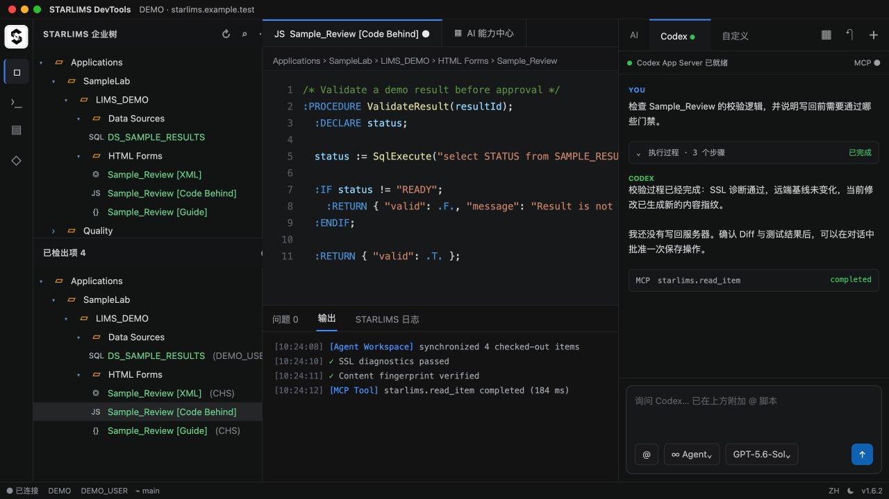
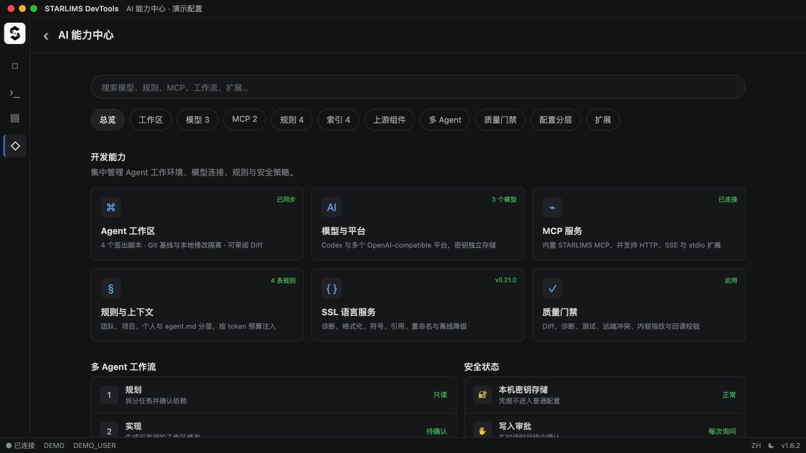
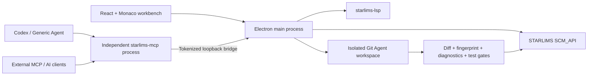

<p align="center">
  <picture>
    <source media="(prefers-color-scheme: dark)" srcset="src/assets/starlims-devtools-mark-white.svg">
    <source media="(prefers-color-scheme: light)" srcset="src/assets/starlims-devtools-mark-black.svg">
    
  </picture>
</p>

<h1 align="center">STARLIMS DevTools</h1>

<p align="center"><a href="README.md">简体中文</a> · <strong>English</strong></p>

<p align="center">AI-native cross-platform development workbench for STARLIMS</p>

STARLIMS DevTools brings the enterprise tree, Monaco editor, SSL language services, source control, isolated Agent workspaces, and MCP tools into one desktop application. AI agents can understand, modify, validate, and write back STARLIMS scripts under explicit permissions and quality gates.

> [!WARNING]
> This is an unofficial community project and is not affiliated with or supported by STARLIMS Corporation. Validate it in a test environment and follow your organization's change-management process before using write, execute, check-in, or undo-checkout operations.





> All screenshots use fictional servers, accounts, scripts, and conversations. They contain no real addresses, credentials, business code, or logs.

## Why STARLIMS DevTools

- **End-to-end STARLIMS workflow:** browse, search, check out, edit, execute, compare, save, check in, undo checkout, and import/export SDP packages.
- **Editor-grade experience:** multi-tab Monaco editor, Problems/Output/STARLIMS Log panels, cross-script navigation, SQL completion, and platform-native shortcuts.
- **Agents that can act:** Codex and OpenAI-compatible agents can use the signed-in session, Agent workspace, and STARLIMS MCP instead of merely producing snippets.
- **Governed automation:** read-only modes, in-conversation approval, unified write gates, remote-conflict detection, content fingerprints, SSL diagnostics, tests, and read-after-write verification.
- **Maintainable upstream integration:** pinned and verified `starlims-lsp` releases plus selective audits of `starlimsvscode`, without whole-repository merges.

## Main capabilities

### STARLIMS development

| Capability | Description |
| --- | --- |
| Enterprise and checkout trees | Browse Applications, Server Scripts, Client Scripts, Data Sources, Tables, and Server Logs. Checked-out items show type icons, owner, and form language under a fixed toolbar. |
| Multilingual HTML Forms | XML, Code Behind, Guide, and Resources retain explicit languages such as `CHS` and `ENG` throughout read, checkout, save, check-in, and MCP operations. |
| Editing and execution | Edit SSL, SQL, JavaScript, XML, and HTML; run Server Scripts and Data Sources; inspect tabular or raw results. |
| Source control | Import/export SDP, compare remote content, and manage checkout, check-in, and undo checkout. |
| Logs and diagnostics | Filter language diagnostics, execution output, and STARLIMS logs by severity, user, and text. |

### SSL and SQL intelligence

- Ships with the persistent [`starlims-lsp`](https://github.com/mahoskye/starlims-lsp) v0.21.0 runtime for diagnostics, formatting, workspace symbols, definitions/references, cross-file rename, CodeLens, inlay hints, and quick fixes.
- Falls back automatically to the built-in TypeScript language core when the native LSP is unavailable.
- Preserves STARLIMS Designer syntax such as `#include "Module.Script"` without a trailing semicolon and formats embedded SQL.
- Selects SSL or SQL behavior for Data Sources from the server-side script language; SQL completion includes keywords, tables, and columns.

### AI, Agents, and MCP

| Capability | Description |
| --- | --- |
| Codex Agent | Keeps sessions through Codex App Server and renders streamed responses, reasoning, MCP calls, commands, file changes, and approval events. |
| Generic Agent | Stores multiple OpenAI-compatible providers, each with its own Base URL, API key, model catalog, and default model. |
| Modes | Agent, Plan, Debug, Multitask, and Ask. Plan and Ask are enforced as read-only at runtime. |
| Context references | `@` references current, open, checked-out, or searched scripts; facts are injected under a token budget instead of concatenating the workspace. |
| Agent workspace | A configurable local Git workspace isolated by server and user, with separate remote baselines, AI edits, and per-file diffs. |
| Built-in MCP | Pins [`tenlyc/starlims-mcp`](https://github.com/tenlyc/starlims-mcp) v0.5.1 and starts its independent process at `http://127.0.0.1:3102/mcp`; a one-time loopback bridge connects it to the signed-in session and approvals, with a built-in compatibility fallback. |
| External MCP | Supports HTTP, SSE, and stdio servers. Sensitive headers and environment variables are stored in the OS credential store. |
| Multi-agent workflows | Planner, implementer, reviewer, and tester roles support dependencies and safe parallelism; the user approves results before the main Agent applies them. |

Call `get_capabilities` after connecting to discover the tools actually registered by the active host, their origin, risk, schema version, Profile, and backend components. Tool origin is either `starlimsvscode` or `starlims-mcp`; DevTools is the host Profile/Adapter. See [MCP architecture and provenance](docs/MCP_ARCHITECTURE.en.md).

### One STARLIMS backend package

`npm run build:scm-api` produces the only deployment package, `SCM_API.sdp`. It combines:

- the base `SCM_API` content from `MrDoe/starlimsvscode`;
- DevTools adapter extensions owned by `tenlyc/starlims-mcp`: `McpGetSCMUsers`, `McpGetCheckInHistory`, `McpExportPackage`, and `McpImportPackage`;
- the Form Designer and required client scripts, resources, images, and `CONTROL_PROPERTIES` table definition.

HTML/XFD Form Resources use `get_form_resources`, `set_form_resource`, and `save_form_resources`. Language is required; prefer `set_form_resource` for a single value so agents do not overwrite other IDs or languages.

### Rules, permissions, and quality gates

- Team, project, and personal rules merge by layer. Imported or pasted `agent.md` content remains a separate, highest-priority user rule.
- Approval modes are Ask every time, Auto-approve safe operations, and Full access. Write approval appears in the conversation timeline.
- Save, check-in, undo checkout, and execution all pass authorization, checkout ownership, language, remote-conflict, SHA-256 fingerprint, and audit checks.
- SSL diagnostics, configurable tests, diff review, deletion policy, and test-result gates run before write-back. Content changes invalidate previous approvals and test results.
- AI extensions use versioned JSON manifests for MCP entries, tool metadata, language mappings, and workflow templates. Manifests cannot contain API keys, tokens, or passwords.

## Architecture



## Quick start

Requirements: Node.js 22.12+, Git, a reachable STARLIMS environment, and the required SCM API enabled in `web.config`:

```xml
<add key="HTTPServices" value="SCM_API.*"/>
```

```bash
git clone https://github.com/tenlyc/starlims-devtools.git
cd starlims-devtools
npm install
npm run dev
```

Verification and packaging:

```bash
# Prepare the verified LSP, lint, run 29 smoke-test groups, and build Renderer/Electron
npm run check

# Build the installer for the current platform
npm run build

# After launching and signing in, verify MCP negotiation and read-only live calls
npm run test:mcp-live
```

Artifacts are written to `release/` and are not committed. The macOS build produces DMG, ZIP, and the unified `SCM_API.sdp`.

## First-time setup

1. Add a STARLIMS server on the sign-in page. Passwords are stored only in the OS credential store.
2. Confirm browsing, reading, checkout, and save compatibility against your STARLIMS version.
3. Choose an Agent workspace root in **AI Capability Center → Workspace** and synchronize checked-out items.
4. Use Codex or add one or more OpenAI-compatible providers and models.
5. Import personal `agent.md`, team/project rules, external MCP servers, and an approval policy as needed.
6. Validate diffs, diagnostics, execution, and check-in in a test environment before connecting to production.

## Keyboard shortcuts

| Action | macOS | Windows / Linux |
| --- | --- | --- |
| Save current script | `⌘S` | `Ctrl+S` |
| Global code search | `⌘⇧F` | `Ctrl+Shift+F` |
| Format document | `⇧⌥F` | `Shift+Alt+F` |
| Toggle comment | `⌘/` | `Ctrl+/` |
| Select all matches | `⌘F2` | `Ctrl+F2` |
| Go to line | `⌘G` | `Ctrl+G` |
| Go to symbol | `⌘⇧O` | `Ctrl+Shift+O` |
| Run current Server Script / Data Source | `F5` | `F5` |
| Go to STARLIMS item | `F11` | `F11` |

## Security and privacy

- STARLIMS passwords, Agent API keys, and external MCP secrets use the Electron/OS credential store and are excluded from ordinary settings and exports.
- Local MCP and internal bridges bind only to `127.0.0.1`; bridge tokens exist only in process memory and environment.
- Plan and Ask are read-only. Unknown external MCP tools are not treated as safe reads by default.
- Full access permits high-risk writes, execution, and deletion; use it only briefly in controlled workspaces and test systems.
- Remove server addresses, user names, scripts, internal paths, conversations, tokens, and API keys before sharing issues, logs, or screenshots.

## Upstream maintenance

Versions are pinned in [`upstreams/upstreams.lock.json`](upstreams/upstreams.lock.json). Automation discovers public changes but never executes or merges upstream code automatically. See the [upstream synchronization policy](UPSTREAM_SYNC.md).

- [`mahoskye/starlims-lsp`](https://github.com/mahoskye/starlims-lsp): verified, replaceable language-service component with manual update and rollback.
- [`MrDoe/starlimsvscode`](https://github.com/MrDoe/starlimsvscode): reference source for SCM contracts, language rules, and compatibility tests; not a runtime dependency.
- [`tenlyc/starlims-mcp`](https://github.com/tenlyc/starlims-mcp): pinned shared MCP contracts/runtime and auditable offline MCP/SCM source snapshots. DevTools remains responsible for host adapters, approval, and transport.

## Project layout

```text
electron/                 Electron and Agent/MCP/LSP/workspace runtimes
src/components/           React workbench, editor, sidebar, AI and SCM UI
src/services/             STARLIMS APIs, language features, permissions and gates
src/scm_api/              Backend scripts deployed to STARLIMS
resources/starlims-lsp/   Verified language-service resources prepared at build time
scripts/                  Smoke tests, packaging preparation and upstream tooling
upstreams/                Version locks, capability maps and compatibility records
components/               First-party shared-component locks
docs/                     Extension examples, architecture and sanitized screenshots
```

## Contributing and releases

Issues and pull requests are welcome. Add smoke tests for new behavior and make sure `npm run check` passes. See [Contributing](CONTRIBUTING.md), [Packaging](PACKAGING.md), [Beta/stable gates](docs/RELEASE_READINESS.md), and the [changelog](CHANGELOG.md).

Bilingual documentation index: [docs/README.md](docs/README.md).

License: [MIT](LICENSE) · Project: https://github.com/tenlyc/starlims-devtools
