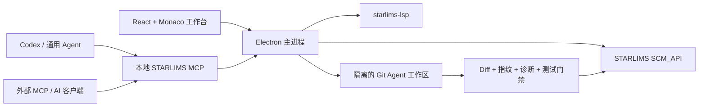

<p align="center">
  <picture>
    <source media="(prefers-color-scheme: dark)" srcset="src/assets/starlims-devtools-mark-white.svg">
    <source media="(prefers-color-scheme: light)" srcset="src/assets/starlims-devtools-mark-black.svg">
    
  </picture>
</p>

<h1 align="center">STARLIMS DevTools</h1>

<p align="center">
  面向 STARLIMS 的 AI 原生跨平台开发工作台<br>
  <sub>AI-native cross-platform development workbench for STARLIMS</sub>
</p>

STARLIMS DevTools 把企业树、Monaco 编辑器、SSL 语言服务、源码管理、Agent 工作区和 MCP 工具整合在一个桌面应用中，让 AI 能在明确的权限与质量门禁下理解、修改、验证并写回 STARLIMS 脚本。

> [!WARNING]
> 本项目是非官方社区工具，与 STARLIMS Corporation 无隶属或支持关系。请先在测试环境验证，并依据组织的变更流程使用写入、运行、检入和撤销签出功能。


> 截图全部由虚构服务器、账号、脚本和对话生成，不包含真实地址、凭据、业务代码或日志。

## 为什么使用它

- **完整 STARLIMS 工作流**：浏览、搜索、签出、编辑、执行、对比、保存、检入、撤销签出，以及 SDP 导入导出。
- **更专业的编辑体验**：多标签 Monaco 编辑器、Problems/Output/STARLIMS Log、跨脚本导航、SQL 智能提示和平台原生快捷键。
- **真正可操作的 AI**：Codex 与通用 OpenAI-compatible Agent 可使用当前登录会话、Agent 工作区和 STARLIMS MCP，不只是在对话中生成代码片段。
- **可治理的自动化**：模式级只读约束、应用内审批、统一写入门禁、远端冲突检测、内容指纹、SSL 诊断、测试和回读校验。
- **可持续的上游集成**：锁定并校验 `starlims-lsp` 发布版本；选择性审计 `starlimsvscode`，避免整仓合并覆盖本项目能力。

## 核心能力

### STARLIMS 开发

| 能力 | 说明 |
| --- | --- |
| 企业树与签出树 | 浏览 Applications、Server Scripts、Client Scripts、Data Sources、Tables 和 Server Logs；签出项固定标题栏、按类型显示图标，并标注用户与表单语言。 |
| 多语言 HTML Form | XML、Code Behind、Guide、Resources 的读取、签出、保存、检入和 MCP 调用均保留 `CHS`/`ENG` 等语言参数。 |
| 编辑与运行 | 编辑 SSL、SQL、JavaScript、XML、HTML 等内容；运行 Server Script 和 Data Source，并在结果视图查看表格或原始输出。 |
| 源码管理 | 导入/导出 SDP，比较远端版本，管理签出/检入与撤销签出。 |
| 日志与问题 | 集中显示语言诊断、运行输出和 STARLIMS 日志，支持级别、用户与文本过滤。 |

### SSL 与 SQL 语言能力

- 随应用提供并持久运行 [`starlims-lsp`](https://github.com/mahoskye/starlims-lsp) v0.21.0，支持诊断、格式化、工作区符号、定义/引用、跨文件重命名、CodeLens、内联提示与快速修复。
- 原生 LSP 不可用时自动降级到内置 TypeScript 语言核心；降级不会阻止继续编辑。
- 保留 STARLIMS Designer 的 `#include "Module.Script"` 无分号语法，并支持内嵌 SQL 格式化。
- Data Source 根据服务端脚本语言选择 SSL 或 SQL；SQL 提供关键字、表名和字段补全。

### AI、Agent 与 MCP

| 能力 | 说明 |
| --- | --- |
| Codex Agent | 通过 Codex App Server 保持会话，展示流式回复、Reasoning、MCP、命令、文件变更和审批事件。 |
| 通用 Agent | 保存多个 OpenAI-compatible 平台，每个平台拥有独立 Base URL、API Key、模型列表和默认模型。 |
| 会话模式 | Agent、Plan、Debug、Multitask、Ask；Plan/Ask 在运行时强制只读。 |
| 上下文引用 | 使用 `@` 引用当前、已打开、已签出或搜索到的脚本；依赖事实按 token 预算注入，避免拼接整个工作区。 |
| Agent 工作区 | 按服务器与用户隔离的本地 Git 工作区，可自定义根目录；远端基线与 AI 修改分开保存并提供逐文件 Diff。 |
| 本地 MCP | `http://127.0.0.1:3102/mcp`，仅监听回环地址，复用当前 STARLIMS 登录会话；工具契约来自固定版本的 [`tenlyc/starlims-mcp`](https://github.com/tenlyc/starlims-mcp)。 |
| 外部 MCP | 在 AI 能力中心配置 HTTP、SSE 或 stdio 服务；敏感请求头和环境变量独立存入本机密钥存储。 |
| 多 Agent 工作流 | 规划、实现、审查、测试角色支持任务依赖与安全并行；结果由用户确认后交给主 Agent 执行。 |

Codex、通用 Agent 与外部 AI 客户端可复用同一 STARLIMS MCP。桌面应用不捆绑第三方模型运行时或 Claude Agent SDK；Claude Code、Cursor、ChatGPT Desktop 等如需使用，应作为独立客户端连接 MCP。

连接后可调用 `get_capabilities` 查看当前工具来源、风险、Schema 版本和后端组件。`SCM_API.*` 保留上游来源，公共扩展使用 `STARLIMS_MCP_API.*`，DevTools 专属扩展使用 `STARLIMS_DEVTOOLS_API.*`；完整边界见 [`docs/MCP_ARCHITECTURE.md`](docs/MCP_ARCHITECTURE.md)。

### 规则、权限与质量门禁

- 团队、项目、个人规则按层合并；用户导入或粘贴的 `agent.md` 独立保存，并保持最高用户规则优先级。
- 权限支持“每次询问”“自动批准安全操作”“完全访问”；写入确认直接显示在对话时间线中。
- 保存、检入、撤销签出和执行统一经过授权、签出状态、语言、远端冲突、SHA-256 内容指纹与审计检查。
- SSL 写回前执行诊断；可配置测试用例、Diff 审查、删除策略和测试结果门禁。内容变化后旧审批与旧测试结果自动失效。
- AI 扩展使用版本化 JSON 清单贡献 MCP、工具元数据、语言映射与工作流模板；清单禁止携带 API Key、Token 或密码。示例见 [`docs/ai-extension.example.json`](docs/ai-extension.example.json)。

## 工作方式



## 快速开始

### 环境要求

- Node.js 22.12 或更高版本
- Git
- 可访问的 STARLIMS 环境
- STARLIMS `web.config` 允许所需 SCM API：

```xml
<add key="HTTPServices" value="SCM_API.*"/>
```

不同 STARLIMS 版本的 `SCM_API` 可能存在差异。建议先在隔离环境安装并验证与当前服务器版本匹配的 SDP 后端脚本。

### 本地开发

```bash
git clone https://github.com/tenlyc/starlims-devtools.git
cd starlims-devtools
npm install
npm run dev
```

### 检查与打包

```bash
# ESLint、22 组 smoke tests、TypeScript、Renderer/Electron 构建
npm run check

# 生成当前平台安装包
npm run build
```

构建产物位于 `release/`，不会提交到 Git。发布前还建议运行：

```bash
npm audit --registry=https://registry.npmjs.org
```

## 首次配置

1. 在登录页新增 STARLIMS 服务器，填写名称、基础 URL 和账号；密码仅存入系统密钥存储。
2. 登录后通过企业树确认浏览、读取、签出和保存是否与当前 STARLIMS 版本兼容。
3. 在“AI 能力中心 → 工作区”选择 Agent 工作区根目录并同步当前用户签出项。
4. 使用 Codex，或在“模型”中新增一个或多个 OpenAI-compatible 平台与模型。
5. 按需导入个人 `agent.md`、团队/项目规则，配置外部 MCP 和写入审批策略。
6. 在测试环境完成 Diff、诊断、执行和检入验证后，再连接生产环境。

## 常用快捷键

| 操作 | macOS | Windows / Linux |
| --- | --- | --- |
| 保存当前脚本 | `⌘S` | `Ctrl+S` |
| 全局代码搜索 | `⌘⇧F` | `Ctrl+Shift+F` |
| 格式化文档 | `⇧⌥F` | `Shift+Alt+F` |
| 注释/取消注释 | `⌘/` | `Ctrl+/` |
| 选择所有匹配 | `⌘F2` | `Ctrl+F2` |
| 跳转到行 | `⌘G` | `Ctrl+G` |
| 跳转到符号 | `⌘⇧O` | `Ctrl+Shift+O` |
| 运行当前 Server Script / Data Source | `F5` | `F5` |
| 跳转到 STARLIMS 项目 | `F11` | `F11` |

编辑器右键菜单会按当前界面语言显示，并自动使用对应平台的快捷键符号。

## 安全与隐私

- STARLIMS 密码、通用 Agent API Key 和外部 MCP secrets 使用 Electron 本机密钥存储，不写入普通配置或导出文件。
- 本地 MCP 默认只监听 `127.0.0.1`；不要把端口转发到不受信任网络。
- Plan/Ask 强制只读；未知外部 MCP 工具不默认视为安全读操作。
- 完全访问会允许写入、运行或删除等高风险操作，只应在受控工作区和测试环境短时开启。
- 提交 Issue、日志与截图前，请移除服务器地址、用户名、脚本内容、内部路径、对话、Token 和 API Key。
- 仓库中的示例、测试与文档截图统一使用 `example.test`、`DEMO_USER` 等虚构数据。

## 上游维护

上游版本统一记录在 [`upstreams/upstreams.lock.json`](upstreams/upstreams.lock.json)，详细策略见 [`UPSTREAM_SYNC.md`](UPSTREAM_SYNC.md)。自动化只检查公开元数据并创建更新提示，不会自动执行或合并上游代码。

```bash
# 检查 starlims-lsp 发布与 starlimsvscode 参考提交
npm run upstream:check

# 生成 starlimsvscode 选择性移植报告
npm run upstream:audit:starlimsvscode -- --output upstreams/reports/starlimsvscode.md

# 审查后推进参考提交
npm run upstream:accept:starlimsvscode -- <40位commit> --confirm-reviewed

# 下载、校验和测试指定 starlims-lsp Release
npm run upstream:update:lsp -- v0.22.0
```

- [`mahoskye/starlims-lsp`](https://github.com/mahoskye/starlims-lsp)：作为受版本锁与 SHA-256 校验的语言服务组件。
- [`MrDoe/starlimsvscode`](https://github.com/MrDoe/starlimsvscode)：作为 STARLIMS SCM 契约、语言规则和兼容测试的参考来源，按能力选择性移植，不作为运行时依赖。
- [`tenlyc/starlims-mcp`](https://github.com/tenlyc/starlims-mcp)：作为固定版本的共享 MCP 契约与运行时依赖；产品仅实现宿主 Adapter、权限和传输。

## 项目结构

```text
electron/                 Electron 主进程、Agent/MCP/LSP/工作区运行时
src/components/           React 工作台、编辑器、侧边栏、AI 与 SCM 界面
src/services/             STARLIMS API、语言能力、权限、写入门禁与索引
src/scm_api/              需要部署到 STARLIMS 的后端脚本
resources/starlims-lsp/   构建时准备的已校验语言服务资源
scripts/                  smoke tests、打包准备与上游维护工具
upstreams/                上游版本锁、能力映射和兼容记录
components/               自有共享组件版本锁（与第三方 upstream 分开）
docs/                     扩展示例与脱敏产品截图
```

## 技术栈

Electron 44 · React 18 · TypeScript 5.9 · Vite 8 · Monaco Editor · Tailwind CSS · Zustand · Model Context Protocol

## 贡献与版本

欢迎通过 [Issues](https://github.com/tenlyc/starlims-devtools/issues) 报告兼容问题或提出改进，也欢迎提交 Pull Request。请为新功能补充 smoke test，并确保 `npm run check` 通过。

- 完整变更记录：[CHANGELOG.md](CHANGELOG.md)
- 上游同步策略：[UPSTREAM_SYNC.md](UPSTREAM_SYNC.md)
- MCP 来源与扩展边界：[docs/MCP_ARCHITECTURE.md](docs/MCP_ARCHITECTURE.md)
- 开源许可：[MIT](LICENSE)

项目主页：https://github.com/tenlyc/starlims-devtools
